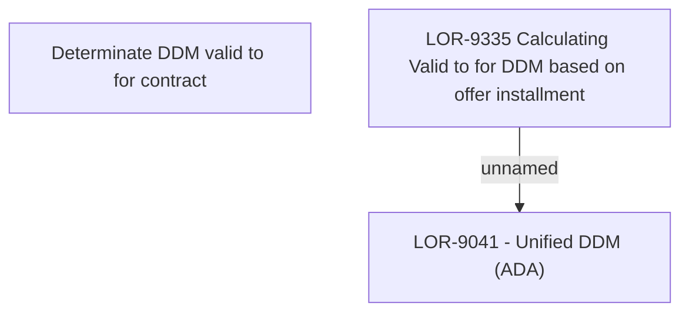

# LOR-9335 Calculating Valid to for DDM based on offer installment

- **Diagram Type**: Custom
- **Package**: HomerSelect/BSL/Requirements Model/In process/LOR/LOR-9041 - Unified DDM (ADA)/LOR-9335 Calculating Valid to for DDM based on offer installment
- **Diagram ID**: 152948
- **Elements**: 3
- **Connectors**: 1

