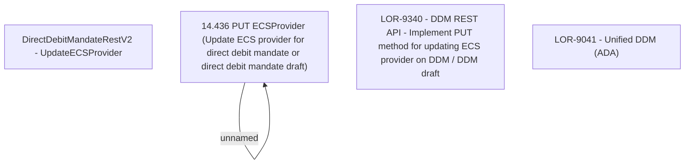

# LOR-9340 - DDM REST API - Implement PUT method for updating ECS provider on DDM / DDM draft

- **Diagram Type**: Custom
- **Package**: HomerSelect/BSL/Requirements Model/In process/LOR/LOR-9041 - Unified DDM (ADA)/LOR-9340 - DDM REST API - Implement PUT method for updating ECS provider on DDM / DDM draft
- **Diagram ID**: 151244
- **Elements**: 5
- **Connectors**: 1

