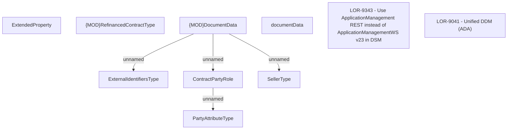

# LOR-9343 - Use ApplicationManagement REST instead of ApplicationManagementWS v23 in DSM

- **Diagram Type**: Custom
- **Package**: HomerSelect/BSL/Requirements Model/In process/LOR/LOR-9041 - Unified DDM (ADA)/LOR-9343 - Use ApplicationManagement REST instead of ApplicationManagementWS v23 in DSM
- **Diagram ID**: 151327
- **Elements**: 10
- **Connectors**: 4

