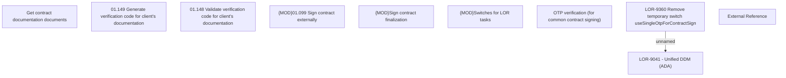

# LOR-9360 Remove temporary switch useSingleOtpForContractSign

```mermaid
graph TD
    Get_contract_documentation_documents["Get contract documentation documents"]
    n_01_149_Generate_verification_code_for_client_s_documentati["01.149 Generate verification code for client's documentation"]
    n_01_148_Validate_verification_code_for_client_s_documentati["01.148 Validate verification code for client's documentation"]
    MOD_01_099_Sign_contract_externally["{MOD}01.099 Sign contract externally"]
    MOD_Sign_contract_finalization["{MOD}Sign contract finalization"]
    MOD_Switches_for_LOR_tasks["{MOD}Switches for LOR tasks"]
    OTP_verification_for_common_contract_signing["OTP verification (for common contract signing)"]
    LOR_9360_Remove_temporary_switch_useSingleOtpForContractSign["LOR-9360 Remove temporary switch useSingleOtpForContractSign"]
    LOR_9041_Unified_DDM_ADA["LOR-9041 - Unified DDM (ADA)"]
    External_Reference["External Reference"]
    LOR_9360_Remove_temporary_switch_useSingleOtpForContractSign -->|unnamed| LOR_9041_Unified_DDM_ADA
```
