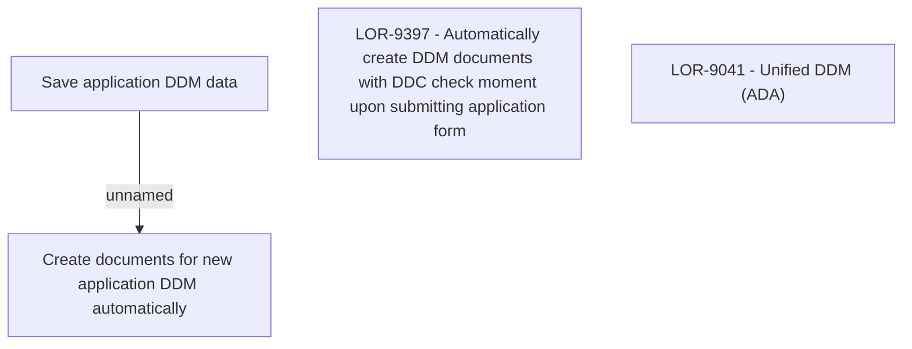

# LOR-9397 - Automatically create DDM documents with DDC check moment upon submitting application form

- **Diagram Type**: Custom
- **Package**: HomerSelect/BSL/Requirements Model/In process/LOR/LOR-9041 - Unified DDM (ADA)/LOR-9397 - Automatically create DDM documents with DDC check moment upon submitting application form
- **Diagram ID**: 151747
- **Elements**: 4
- **Connectors**: 1

