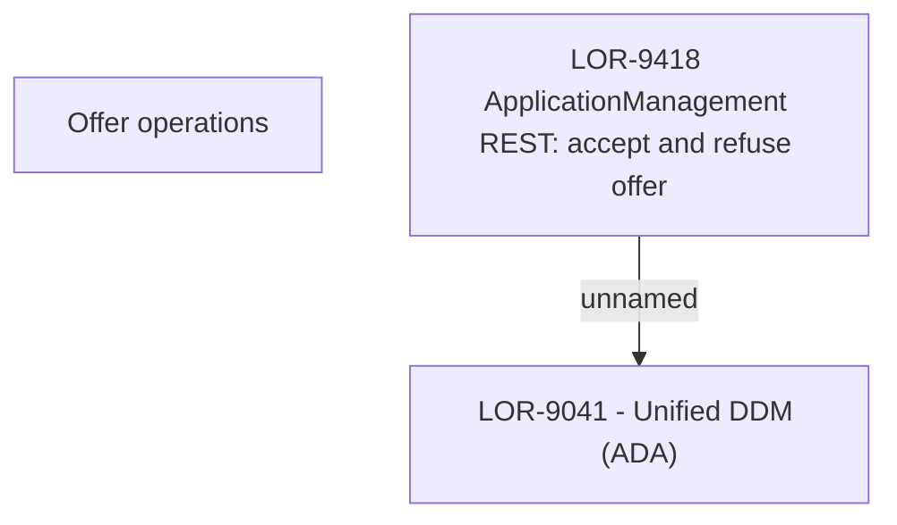

# LOR-9418 ApplicationManagement REST: accept & refuse offer

- **Diagram Type**: Custom
- **Package**: HomerSelect/BSL/Requirements Model/In process/LOR/LOR-9041 - Unified DDM (ADA)/LOR-9418 ApplicationManagement REST: accept & refuse offer
- **Diagram ID**: 152950
- **Elements**: 3
- **Connectors**: 1

