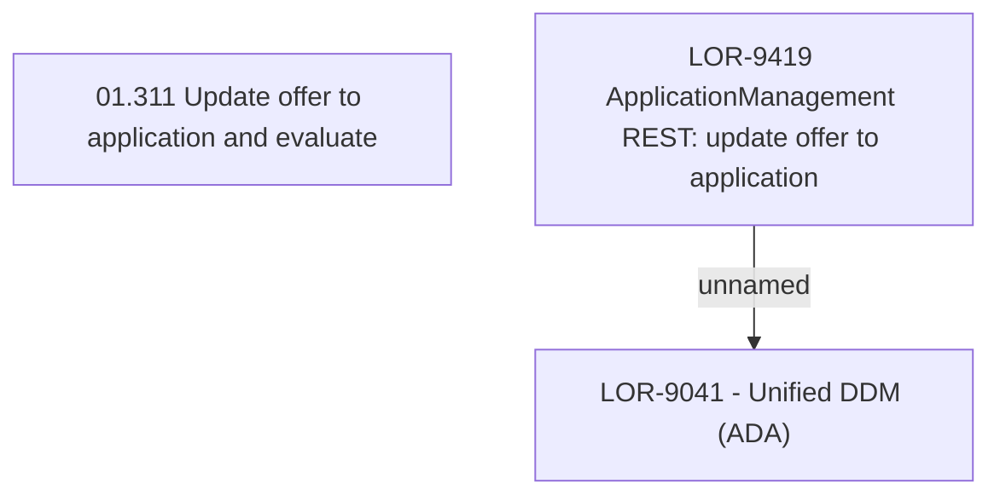

# LOR-9419 ApplicationManagement REST: update offer to application

```mermaid
graph TD
    n_01_311_Update_offer_to_application_and_evaluate["01.311 Update offer to application and evaluate"]
    LOR_9419_ApplicationManagement_REST_update_offer_to_applicat["LOR-9419 ApplicationManagement REST: update offer to application"]
    LOR_9041_Unified_DDM_ADA["LOR-9041 - Unified DDM (ADA)"]
    LOR_9419_ApplicationManagement_REST_update_offer_to_applicat -->|unnamed| LOR_9041_Unified_DDM_ADA
```
