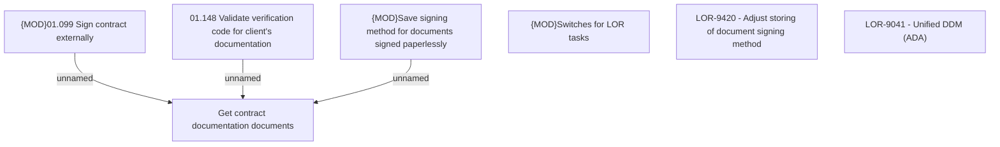

# LOR-9420 - Adjust storing of document signing method

```mermaid
graph TD
    MOD_01_099_Sign_contract_externally["{MOD}01.099 Sign contract externally"]
    Get_contract_documentation_documents["Get contract documentation documents"]
    n_01_148_Validate_verification_code_for_client_s_documentati["01.148 Validate verification code for client's documentation"]
    MOD_Save_signing_method_for_documents_signed_paperlessly["{MOD}Save signing method for documents signed paperlessly"]
    MOD_Switches_for_LOR_tasks["{MOD}Switches for LOR tasks"]
    LOR_9420_Adjust_storing_of_document_signing_method["LOR-9420 - Adjust storing of document signing method"]
    LOR_9041_Unified_DDM_ADA["LOR-9041 - Unified DDM (ADA)"]
    MOD_01_099_Sign_contract_externally -->|unnamed| Get_contract_documentation_documents
    n_01_148_Validate_verification_code_for_client_s_documentati -->|unnamed| Get_contract_documentation_documents
    MOD_Save_signing_method_for_documents_signed_paperlessly -->|unnamed| Get_contract_documentation_documents
```
