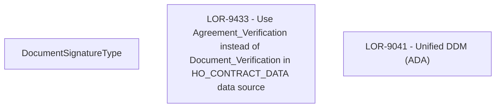

# LOR-9433 - Use Agreement_Verification instead of Document_Verification in HO_CONTRACT_DATA data source

- **Diagram Type**: Custom
- **Package**: HomerSelect/BSL/Requirements Model/In process/LOR/LOR-9041 - Unified DDM (ADA)/LOR-9433 - Use Agreement_Verification instead of Document_Verification in HO_CONTRACT_DATA data source
- **Diagram ID**: 152139
- **Elements**: 3
- **Connectors**: 0

