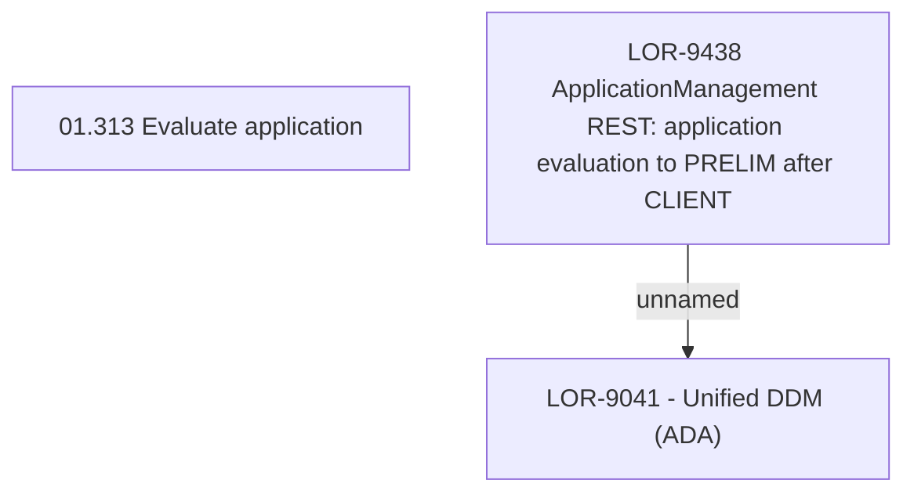

# LOR-9438 ApplicationManagement REST: application evaluation to PRELIM after CLIENT

- **Diagram Type**: Custom
- **Package**: HomerSelect/BSL/Requirements Model/In process/LOR/LOR-9041 - Unified DDM (ADA)/LOR-9438 ApplicationManagement REST: application evaluation to PRELIM after CLIENT
- **Diagram ID**: 152952
- **Elements**: 3
- **Connectors**: 1

