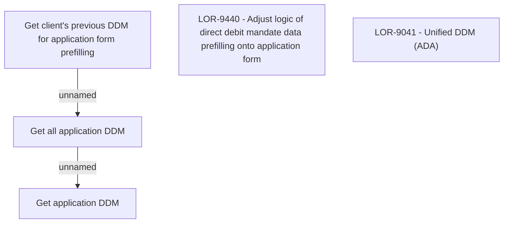

# LOR-9440 - Adjust logic of direct debit mandate data prefilling onto application form

- **Diagram Type**: Custom
- **Package**: HomerSelect/BSL/Requirements Model/In process/LOR/LOR-9041 - Unified DDM (ADA)/LOR-9440 - Adjust logic of direct debit mandate data prefilling onto application form
- **Diagram ID**: 152089
- **Elements**: 5
- **Connectors**: 2

