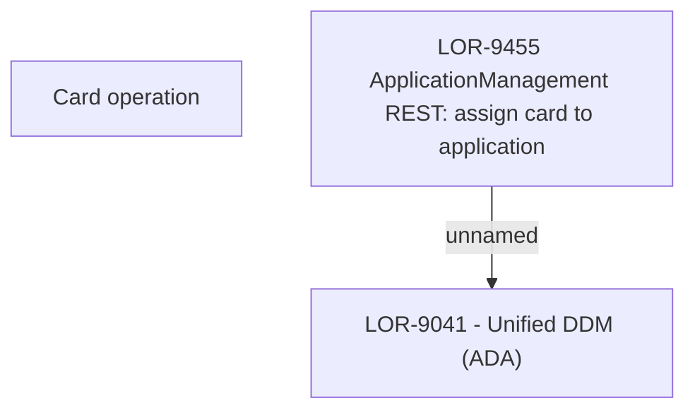

# LOR-9455 ApplicationManagement REST: assign card to application

- **Diagram Type**: Custom
- **Package**: HomerSelect/BSL/Requirements Model/In process/LOR/LOR-9041 - Unified DDM (ADA)/LOR-9455 ApplicationManagement REST: assign card to application
- **Diagram ID**: 152953
- **Elements**: 3
- **Connectors**: 1

