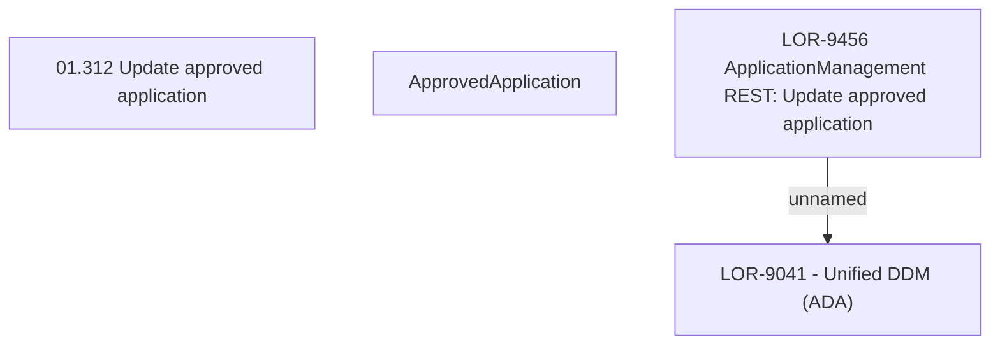

# LOR-9456 ApplicationManagement REST: Update approved application

```mermaid
graph TD
    n_01_312_Update_approved_application["01.312 Update approved application"]
    ApprovedApplication["ApprovedApplication"]
    LOR_9456_ApplicationManagement_REST_Update_approved_applicat["LOR-9456 ApplicationManagement REST: Update approved application"]
    LOR_9041_Unified_DDM_ADA["LOR-9041 - Unified DDM (ADA)"]
    LOR_9456_ApplicationManagement_REST_Update_approved_applicat -->|unnamed| LOR_9041_Unified_DDM_ADA
```
