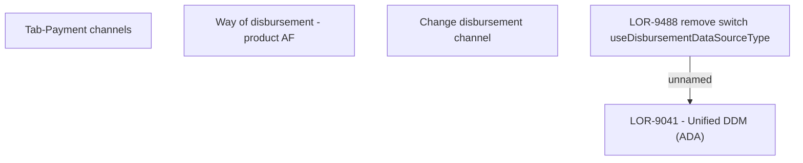

# LOR-9488 remove switch useDisbursementDataSourceType

```mermaid
graph TD
    Tab_Payment_channels["Tab - Payment channels"]
    Tab_Payment_channels["Tab-Payment channels"]
    Way_of_disbursement_product_AF["Way of disbursement - product AF"]
    Change_disbursement_channel["Change disbursement channel"]
    Change_disbursement_channel["Change disbursement channel"]
    LOR_9488_remove_switch_useDisbursementDataSourceType["LOR-9488 remove switch useDisbursementDataSourceType"]
    LOR_9041_Unified_DDM_ADA["LOR-9041 - Unified DDM (ADA)"]
    LOR_9488_remove_switch_useDisbursementDataSourceType -->|unnamed| LOR_9041_Unified_DDM_ADA
```
