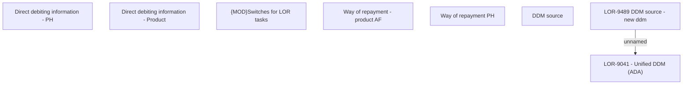

# LOR-9489 DDM source - new ddm

```mermaid
graph TD
    Direct_debiting_information_PH["Direct debiting information - PH"]
    Direct_debiting_information_Product["Direct debiting information - Product"]
    MOD_Switches_for_LOR_tasks["{MOD}Switches for LOR tasks"]
    Way_of_repayment_product_AF["Way of repayment - product AF"]
    Way_of_repayment_PH["Way of  repayment PH"]
    DDM_source["DDM source"]
    LOR_9489_DDM_source_new_ddm["LOR-9489 DDM source - new ddm"]
    LOR_9041_Unified_DDM_ADA["LOR-9041 - Unified DDM (ADA)"]
    LOR_9489_DDM_source_new_ddm -->|unnamed| LOR_9041_Unified_DDM_ADA
```
