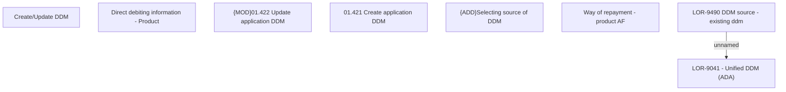

# LOR-9490 DDM source - existing ddm

- **Diagram Type**: Custom
- **Package**: HomerSelect/BSL/Requirements Model/In process/LOR/LOR-9041 - Unified DDM (ADA)/LOR-9490 DDM source - existing ddm
- **Diagram ID**: 152957
- **Elements**: 8
- **Connectors**: 1

