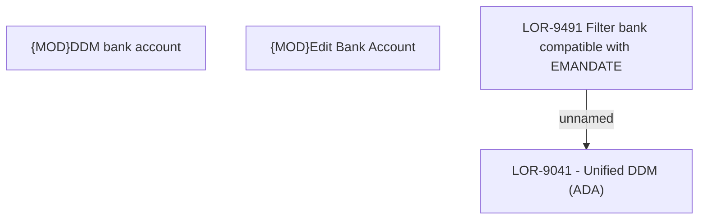

# LOR-9491 Filter bank compatible with EMANDATE

```mermaid
graph TD
    MOD_DDM_bank_account["{MOD}DDM bank account"]
    MOD_Edit_Bank_Account["{MOD}Edit Bank Account"]
    LOR_9491_Filter_bank_compatible_with_EMANDATE["LOR-9491 Filter bank compatible with EMANDATE"]
    LOR_9041_Unified_DDM_ADA["LOR-9041 - Unified DDM (ADA)"]
    LOR_9491_Filter_bank_compatible_with_EMANDATE -->|unnamed| LOR_9041_Unified_DDM_ADA
```
