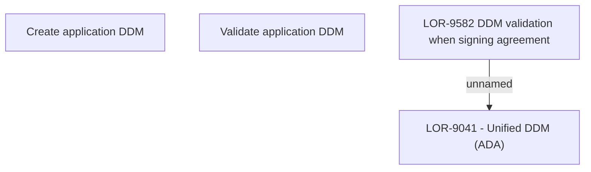

# LOR-9582 DDM validation when signing agreement

```mermaid
graph TD
    Create_application_DDM["Create application DDM"]
    Validate_application_DDM["Validate application DDM"]
    LOR_9582_DDM_validation_when_signing_agreement["LOR-9582 DDM validation when signing agreement"]
    LOR_9041_Unified_DDM_ADA["LOR-9041 - Unified DDM (ADA)"]
    LOR_9582_DDM_validation_when_signing_agreement -->|unnamed| LOR_9041_Unified_DDM_ADA
```
