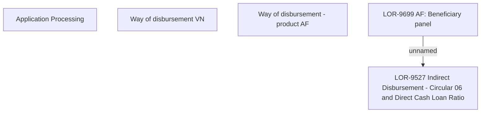

# LOR-9699 AF: Beneficiary panel

```mermaid
graph TD
    Application_Processing["Application Processing"]
    Way_of_disbursement_VN["Way of disbursement VN"]
    Way_of_disbursement_product_AF["Way of disbursement - product AF"]
    LOR_9699_AF_Beneficiary_panel["LOR-9699 AF: Beneficiary panel"]
    LOR_9527_Indirect_Disbursement_Circular_06_and_Direct_Cash_L["LOR-9527 Indirect Disbursement - Circular 06 and Direct Cash Loan Ratio"]
    LOR_9699_AF_Beneficiary_panel -->|unnamed| LOR_9527_Indirect_Disbursement_Circular_06_and_Direct_Cash_L
```
