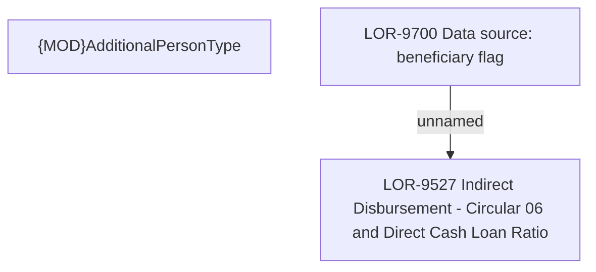

# LOR-9700 Data source: beneficiary flag

```mermaid
graph TD
    MOD_AdditionalPersonType["{MOD}AdditionalPersonType"]
    LOR_9700_Data_source_beneficiary_flag["LOR-9700 Data source: beneficiary flag"]
    LOR_9527_Indirect_Disbursement_Circular_06_and_Direct_Cash_L["LOR-9527 Indirect Disbursement - Circular 06 and Direct Cash Loan Ratio"]
    LOR_9700_Data_source_beneficiary_flag -->|unnamed| LOR_9527_Indirect_Disbursement_Circular_06_and_Direct_Cash_L
```
