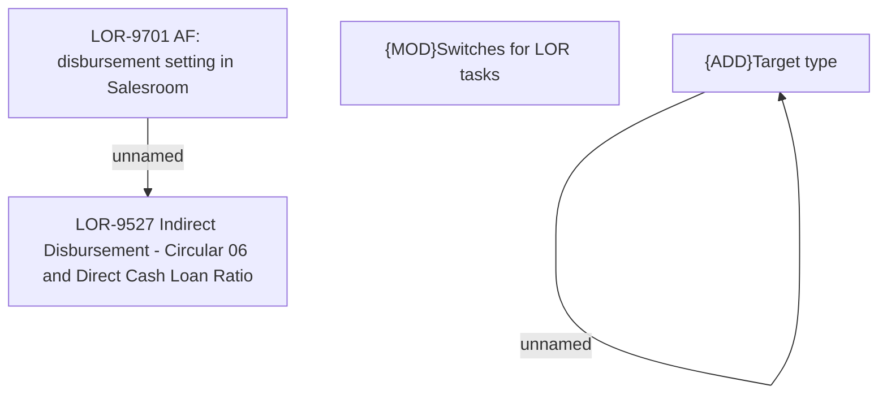

# LOR-9701 AF: disbursement setting in Salesroom

- **Diagram Type**: Custom
- **Package**: HomerSelect/BSL/Requirements Model/In process/LOR/LOR-9527 Indirect Disbursement - Circular 06 and Direct Cash Loan Ratio/LOR-9701 AF: disbursement setting in Salesroom
- **Diagram ID**: 154241
- **Elements**: 5
- **Connectors**: 2

