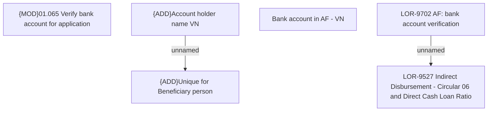

# LOR-9702 AF: bank account verification

```mermaid
graph TD
    LOR_9527_Indirect_Disbursement_Circular_06_and_Direct_Cash_L["LOR-9527 Indirect Disbursement - Circular 06 and Direct Cash Loan Ratio"]
    MOD_01_065_Verify_bank_account_for_application["{MOD}01.065 Verify bank account for application"]
    ADD_Unique_for_Beneficiary_person["{ADD}Unique for Beneficiary person"]
    ADD_Account_holder_name_VN["{ADD}Account holder name VN"]
    Bank_account_in_AF_VN["Bank account in AF - VN"]
    LOR_9702_AF_bank_account_verification["LOR-9702 AF: bank account verification"]
    LOR_9702_AF_bank_account_verification -->|unnamed| LOR_9527_Indirect_Disbursement_Circular_06_and_Direct_Cash_L
    ADD_Account_holder_name_VN -->|unnamed| ADD_Unique_for_Beneficiary_person
```
