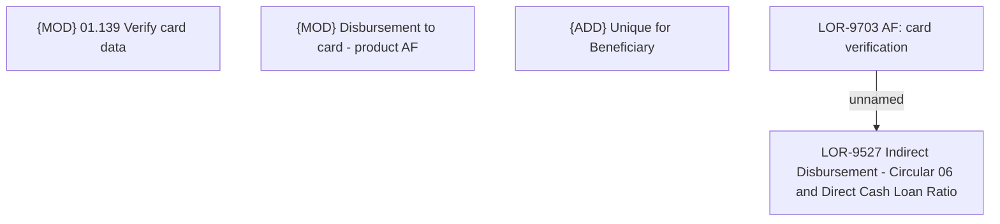

# LOR-9703 AF: card verification

```mermaid
graph TD
    LOR_9527_Indirect_Disbursement_Circular_06_and_Direct_Cash_L["LOR-9527 Indirect Disbursement - Circular 06 and Direct Cash Loan Ratio"]
    MOD_01_139_Verify_card_data["{MOD} 01.139 Verify card data"]
    MOD_Disbursement_to_card_product_AF["{MOD} Disbursement to card - product AF"]
    ADD_Unique_for_Beneficiary["{ADD} Unique for Beneficiary
"]
    LOR_9703_AF_card_verification["LOR-9703 AF: card verification"]
    LOR_9703_AF_card_verification -->|unnamed| LOR_9527_Indirect_Disbursement_Circular_06_and_Direct_Cash_L
```
