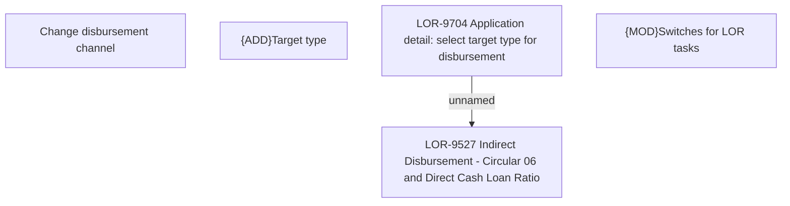

# LOR-9704 Application detail: select target type for disbursement

- **Diagram Type**: Custom
- **Package**: HomerSelect/BSL/Requirements Model/In process/LOR/LOR-9527 Indirect Disbursement - Circular 06 and Direct Cash Loan Ratio/LOR-9704 Application detail: select target type for disbursement
- **Diagram ID**: 154700
- **Elements**: 7
- **Connectors**: 1

