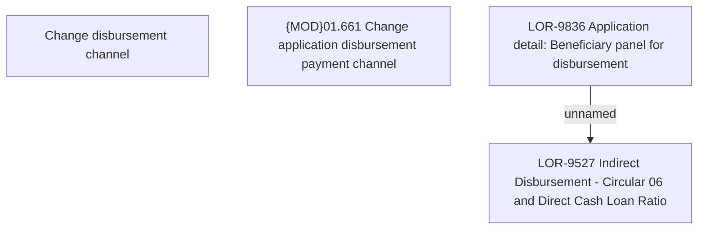

# LOR-9836 Application detail: Beneficiary panel for disbursement

- **Diagram Type**: Custom
- **Package**: HomerSelect/BSL/Requirements Model/In process/LOR/LOR-9527 Indirect Disbursement - Circular 06 and Direct Cash Loan Ratio/LOR-9836 Application detail: Beneficiary panel for disbursement
- **Diagram ID**: 154864
- **Elements**: 4
- **Connectors**: 1

