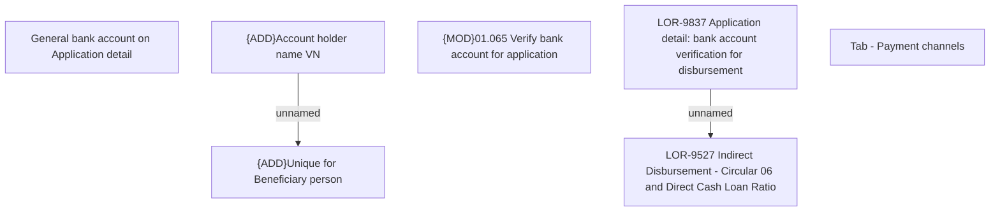

# LOR-9837 Application detail: bank account verification for disbursement

```mermaid
graph TD
    General_bank_account_on_Application_detail["General bank account on Application detail"]
    ADD_Account_holder_name_VN["{ADD}Account holder name VN"]
    ADD_Unique_for_Beneficiary_person["{ADD}Unique for Beneficiary person"]
    MOD_01_065_Verify_bank_account_for_application["{MOD}01.065 Verify bank account for application"]
    LOR_9837_Application_detail_bank_account_verification_for_di["LOR-9837 Application detail: bank account verification for disbursement"]
    LOR_9527_Indirect_Disbursement_Circular_06_and_Direct_Cash_L["LOR-9527 Indirect Disbursement - Circular 06 and Direct Cash Loan Ratio"]
    Tab_Payment_channels["Tab - Payment channels"]
    LOR_9837_Application_detail_bank_account_verification_for_di -->|unnamed| LOR_9527_Indirect_Disbursement_Circular_06_and_Direct_Cash_L
    ADD_Account_holder_name_VN -->|unnamed| ADD_Unique_for_Beneficiary_person
```
