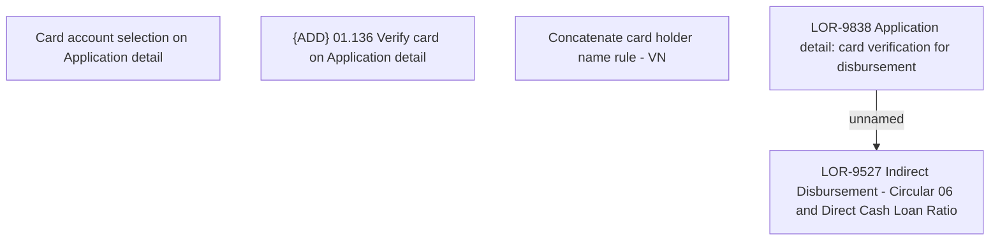

# LOR-9838 Application detail: card verification for disbursement

```mermaid
graph TD
    Card_account_selection_on_Application_detail["Card account selection on Application detail"]
    ADD_01_136_Verify_card_on_Application_detail["{ADD} 01.136 Verify card on Application detail"]
    Concatenate_card_holder_name_rule_VN["Concatenate card holder name rule - VN"]
    LOR_9527_Indirect_Disbursement_Circular_06_and_Direct_Cash_L["LOR-9527 Indirect Disbursement - Circular 06 and Direct Cash Loan Ratio"]
    LOR_9838_Application_detail_card_verification_for_disburseme["LOR-9838 Application detail: card verification for disbursement"]
    LOR_9838_Application_detail_card_verification_for_disburseme -->|unnamed| LOR_9527_Indirect_Disbursement_Circular_06_and_Direct_Cash_L
```
