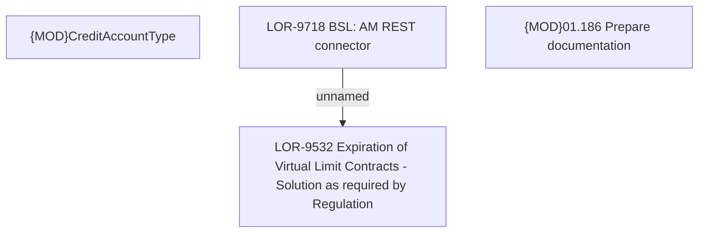

# LOR-9532 Expiration of Virtual Limit Contracts - Solution as required by Regulation

- **Diagram Type**: Custom
- **Package**: HomerSelect/BSL/Requirements Model/In process/LOR/LOR-9532 Expiration of Virtual Limit Contracts - Solution as required by Regulation
- **Diagram ID**: 154117
- **Elements**: 4
- **Connectors**: 1

