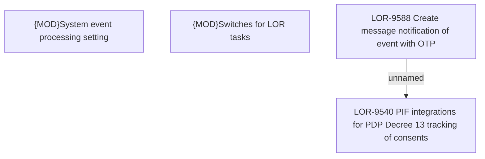

# LOR-9540 PIF integrations for PDP Decree 13 tracking of consents

- **Diagram Type**: Custom
- **Package**: HomerSelect/BSL/Requirements Model/In process/LOR/LOR-9540 PIF integrations for PDP Decree 13 tracking of consents
- **Diagram ID**: 152964
- **Elements**: 4
- **Connectors**: 1

