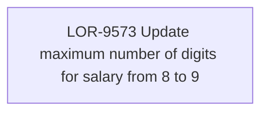

# LOR-9573 Update maximum number of digits for salary from 8 to 9

- **Diagram Type**: Custom
- **Package**: HomerSelect/BSL/Requirements Model/In process/LOR/LOR-9573 Update maximum number of digits for salary from 8 to 9
- **Diagram ID**: 157594
- **Elements**: 1
- **Connectors**: 0

