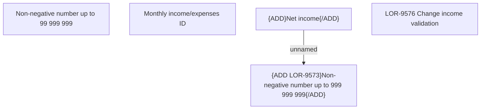

# LOR-9576 Change income validation

- **Diagram Type**: Custom
- **Package**: HomerSelect/BSL/Requirements Model/In process/LOR/LOR-9573 Update maximum number of digits for salary from 8 to 9/LOR-9576 Change income validation
- **Diagram ID**: 157595
- **Elements**: 5
- **Connectors**: 1

