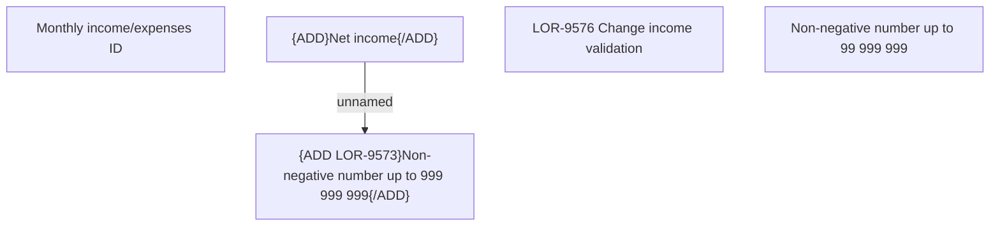

# LOR-9576 Change income validation

```mermaid
graph TD
    Monthly_income_expenses_ID["Monthly income/expenses ID"]
    ADD_Net_income_ADD["{ADD}Net income{/ADD}"]
    ADD_LOR_9573_Non_negative_number_up_to_999_999_999_ADD["{ADD LOR-9573}Non-negative number up to 999 999 999{/ADD}"]
    LOR_9576_Change_income_validation["LOR-9576 Change income validation"]
    Non_negative_number_up_to_99_999_999["Non-negative number up to 99 999 999  "]
    ADD_Net_income_ADD -->|unnamed| ADD_LOR_9573_Non_negative_number_up_to_999_999_999_ADD
```
