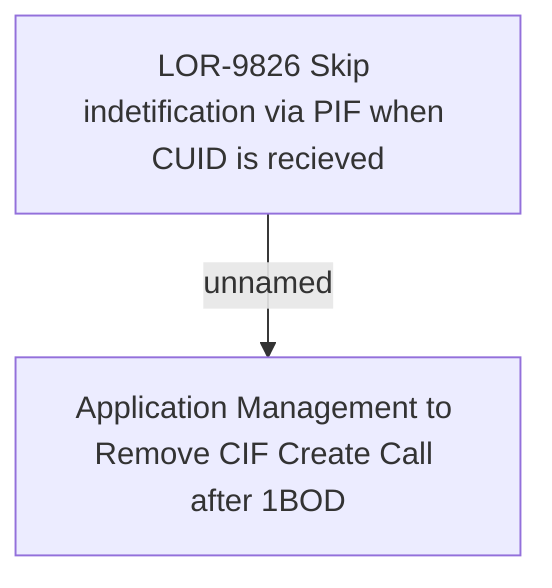

# LOR-9591 Application Management to Remove CIF Create Call after 1BOD

- **Diagram Type**: Custom
- **Package**: HomerSelect/BSL/Requirements Model/In process/LOR/LOR-9591 Application Management to Remove CIF Create Call after 1BOD
- **Diagram ID**: 154582
- **Elements**: 2
- **Connectors**: 1

