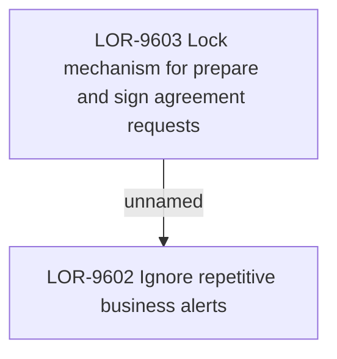

# LOR-9602 Ignore repetitive business alerts

- **Diagram Type**: Custom
- **Package**: HomerSelect/BSL/Requirements Model/In process/LOR/LOR-9602 Ignore repetitive business alerts
- **Diagram ID**: 153492
- **Elements**: 2
- **Connectors**: 1

