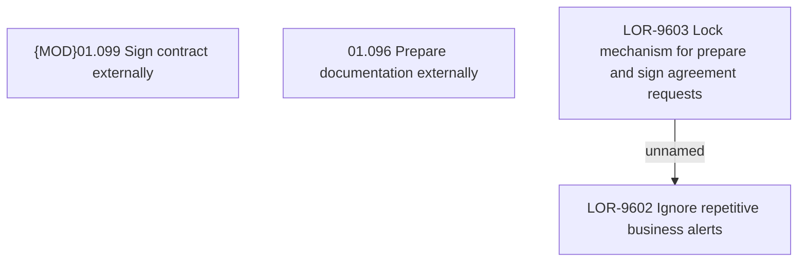

# LOR-9603 Lock mechanism for prepare and sign agreement requests

```mermaid
graph TD
    MOD_01_099_Sign_contract_externally["{MOD}01.099 Sign contract externally"]
    n_01_096_Prepare_documentation_externally["01.096 Prepare documentation externally"]
    LOR_9603_Lock_mechanism_for_prepare_and_sign_agreement_reque["LOR-9603 Lock mechanism for prepare and sign agreement requests"]
    LOR_9602_Ignore_repetitive_business_alerts["LOR-9602 Ignore repetitive business alerts"]
    LOR_9603_Lock_mechanism_for_prepare_and_sign_agreement_reque -->|unnamed| LOR_9602_Ignore_repetitive_business_alerts
```
