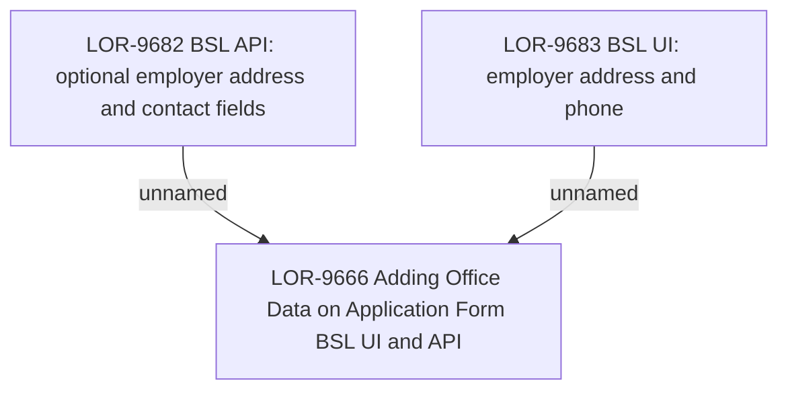

# LOR-9666 Adding Office Data on Application Form BSL UI and API

- **Diagram Type**: Custom
- **Package**: HomerSelect/BSL/Requirements Model/In process/LOR/LOR-9666 Adding Office Data on Application Form BSL UI and API
- **Diagram ID**: 154037
- **Elements**: 3
- **Connectors**: 2

