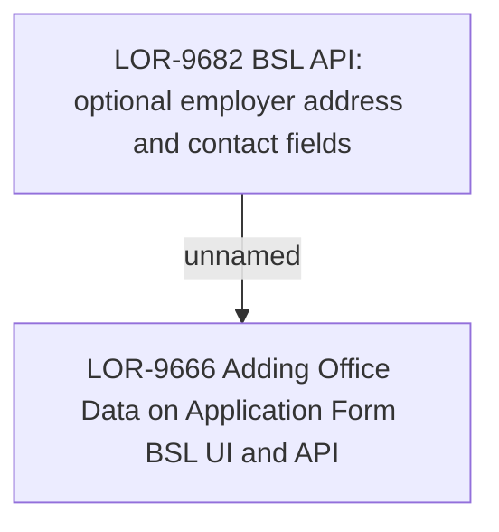

# LOR-9682 BSL API: optional employer address and contact fields

- **Diagram Type**: Custom
- **Package**: HomerSelect/BSL/Requirements Model/In process/LOR/LOR-9666 Adding Office Data on Application Form BSL UI and API/LOR-9682 BSL API: optional employer address and contact fields
- **Diagram ID**: 154038
- **Elements**: 2
- **Connectors**: 1

