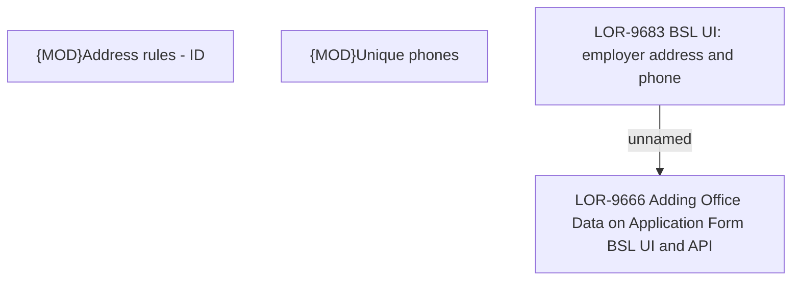

# LOR-9683 BSL UI: employer address and phone

```mermaid
graph TD
    LOR_9666_Adding_Office_Data_on_Application_Form_BSL_UI_and_A["LOR-9666 Adding Office Data on Application Form BSL UI and API"]
    MOD_Address_rules_ID["{MOD}Address rules - ID"]
    MOD_Unique_phones["{MOD}Unique phones "]
    LOR_9683_BSL_UI_employer_address_and_phone["LOR-9683 BSL UI: employer address and phone"]
    LOR_9683_BSL_UI_employer_address_and_phone -->|unnamed| LOR_9666_Adding_Office_Data_on_Application_Form_BSL_UI_and_A
```
