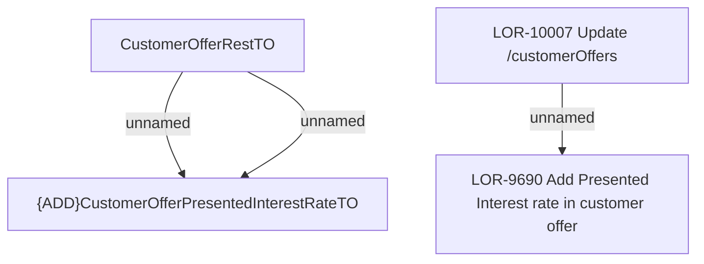

# LOR-10007 Update /customerOffers

- **Diagram Type**: Custom
- **Package**: HomerSelect/BSL/Requirements Model/In process/LOR/LOR-9690 Add Presented Interest rate in customer offer/LOR-10007 Update /customerOffers
- **Diagram ID**: 156509
- **Elements**: 6
- **Connectors**: 3

