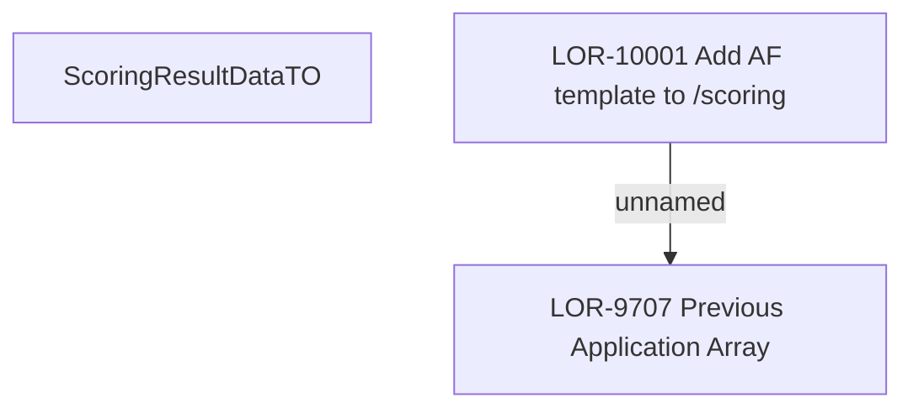

# LOR-10001 Add AF template to /scoring

```mermaid
graph TD
    ScoringResultDataTO["ScoringResultDataTO"]
    LOR_10001_Add_AF_template_to_scoring["LOR-10001 Add AF template to /scoring"]
    LOR_9707_Previous_Application_Array["LOR-9707 Previous Application Array"]
    LOR_10001_Add_AF_template_to_scoring -->|unnamed| LOR_9707_Previous_Application_Array
```
