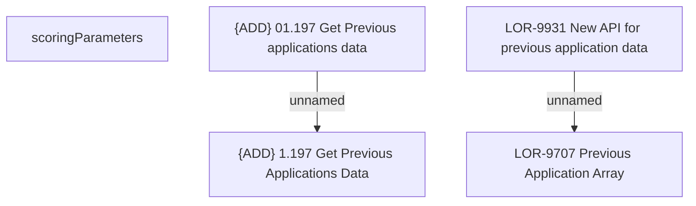

# LOR-9931 New API for previous application data

- **Diagram Type**: Custom
- **Package**: HomerSelect/BSL/Requirements Model/In process/LOR/LOR-9707 Previous Application Array/LOR-9931 New API for previous application data
- **Diagram ID**: 155768
- **Elements**: 5
- **Connectors**: 2

