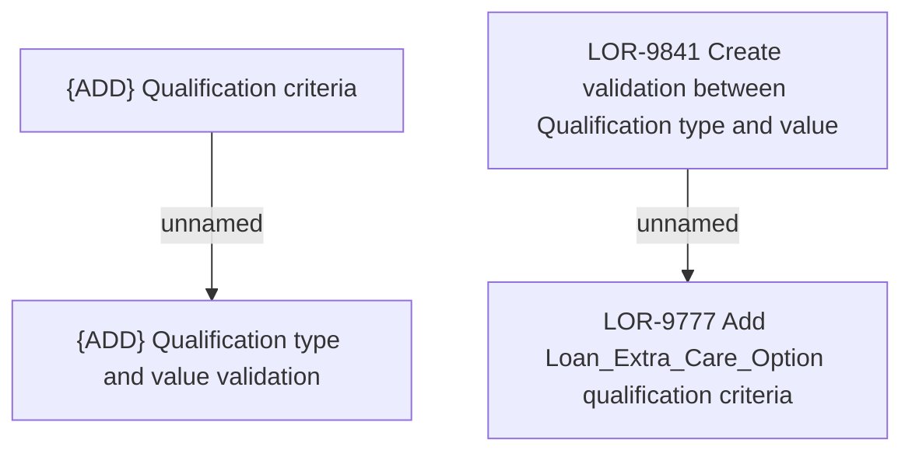

# LOR-9841 Create validation between Qualification type and value

- **Diagram Type**: Custom
- **Package**: HomerSelect/BSL/Requirements Model/In process/LOR/LOR-9777 Add Loan_Extra_Care_Option qualification criteria/LOR-9841 Create validation between Qualification type and value
- **Diagram ID**: 155239
- **Elements**: 4
- **Connectors**: 2

