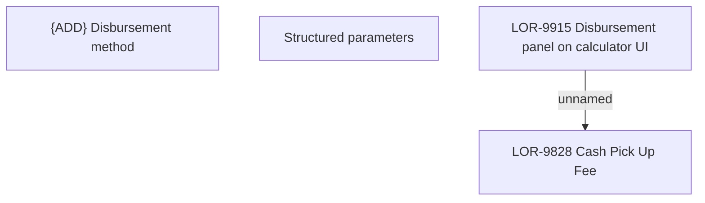

# LOR-9915 Disbursement panel on calculator UI

- **Diagram Type**: Custom
- **Package**: HomerSelect/BSL/Requirements Model/In process/LOR/LOR-9828 Cash Pick Up Fee/LOR-9915 Disbursement panel on calculator UI
- **Diagram ID**: 155792
- **Elements**: 4
- **Connectors**: 1

