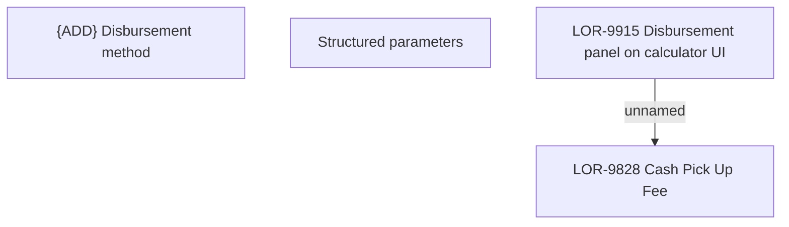

# LOR-9915 Disbursement panel on calculator UI

```mermaid
graph TD
    ADD_Disbursement_method["{ADD} Disbursement method"]
    Structured_parameters["Structured parameters"]
    LOR_9828_Cash_Pick_Up_Fee["LOR-9828 Cash Pick Up Fee"]
    LOR_9915_Disbursement_panel_on_calculator_UI["LOR-9915 Disbursement panel on calculator UI"]
    LOR_9915_Disbursement_panel_on_calculator_UI -->|unnamed| LOR_9828_Cash_Pick_Up_Fee
```
