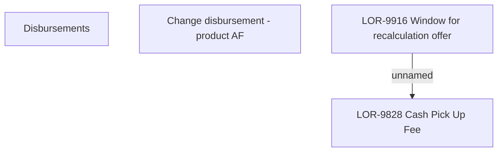

# LOR-9916 Window for recalculation offer

```mermaid
graph TD
    Disbursements["Disbursements"]
    Change_disbursement_product_AF["Change disbursement - product AF"]
    LOR_9828_Cash_Pick_Up_Fee["LOR-9828 Cash Pick Up Fee"]
    LOR_9916_Window_for_recalculation_offer["LOR-9916 Window for recalculation offer"]
    LOR_9916_Window_for_recalculation_offer -->|unnamed| LOR_9828_Cash_Pick_Up_Fee
```
