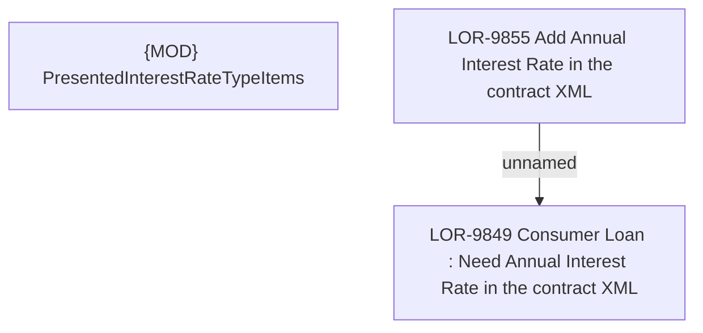

# LOR-9855 Add Annual Interest Rate in the contract XML

- **Diagram Type**: Custom
- **Package**: HomerSelect/BSL/Requirements Model/In process/LOR/LOR-9849 Consumer Loan : Need Annual Interest Rate in the contract XML/LOR-9855 Add Annual Interest Rate in the contract XML
- **Diagram ID**: 155242
- **Elements**: 3
- **Connectors**: 1

