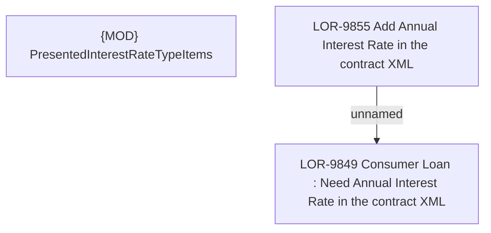

# LOR-9855 Add Annual Interest Rate in the contract XML

```mermaid
graph TD
    MOD_PresentedInterestRateTypeItems["{MOD} PresentedInterestRateTypeItems"]
    LOR_9855_Add_Annual_Interest_Rate_in_the_contract_XML["LOR-9855 Add Annual Interest Rate in the contract XML"]
    LOR_9849_Consumer_Loan_Need_Annual_Interest_Rate_in_the_cont["LOR-9849 Consumer Loan : Need Annual Interest Rate in the contract XML"]
    LOR_9855_Add_Annual_Interest_Rate_in_the_contract_XML -->|unnamed| LOR_9849_Consumer_Loan_Need_Annual_Interest_Rate_in_the_cont
```
