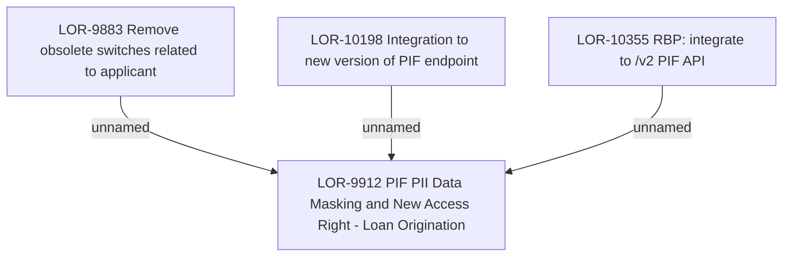

# LOR-9912 PIF PII Data Masking & New Access Right - Loan Origination

- **Diagram Type**: Custom
- **Package**: HomerSelect/BSL/Requirements Model/In process/LOR/LOR-9912 PIF PII Data Masking & New Access Right - Loan Origination
- **Diagram ID**: 159089
- **Elements**: 4
- **Connectors**: 3

