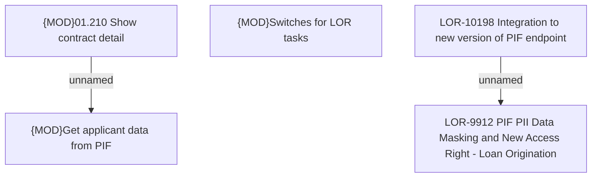

# LOR-10198 Integration to new version of PIF endpoint

- **Diagram Type**: Custom
- **Package**: HomerSelect/BSL/Requirements Model/In process/LOR/LOR-9912 PIF PII Data Masking & New Access Right - Loan Origination/LOR-10198 Integration to new version of PIF endpoint
- **Diagram ID**: 159132
- **Elements**: 5
- **Connectors**: 2

