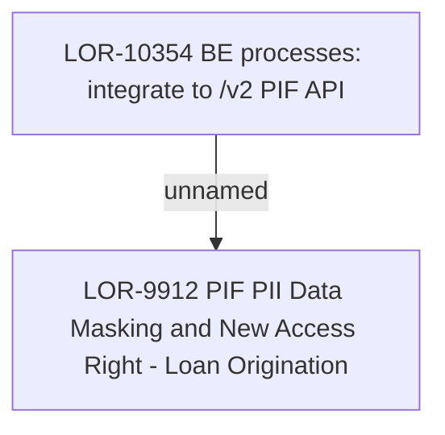

# LOR-10354 BE processes: integrate to /v2 PIF API

```mermaid
graph TD
    LOR_10354_BE_processes_integrate_to_v2_PIF_API["LOR-10354 BE processes: integrate to /v2 PIF API"]
    LOR_9912_PIF_PII_Data_Masking_New_Access_Right_Loan_Originat["LOR-9912 PIF PII Data Masking and New Access Right - Loan Origination"]
    LOR_10354_BE_processes_integrate_to_v2_PIF_API -->|unnamed| LOR_9912_PIF_PII_Data_Masking_New_Access_Right_Loan_Originat
```
